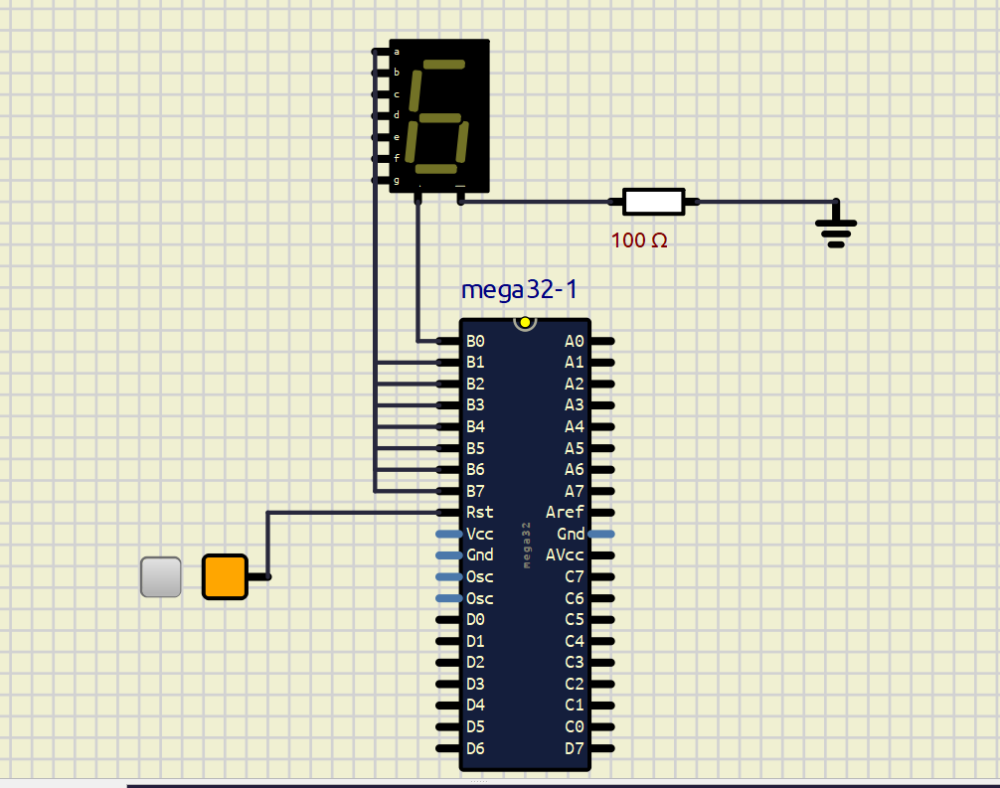

# ATmega32A 7-Segment LED Counter

## Overview

This project implements a 7-segment LED counter using AVR Assembly Language and SimulIDE for ATmega32A microcontroller.

---

## Features

- AVR Assembly implementation for ATmega32A
- Seven-segment display
- Counts down from 9 to 0
- SimulIDE simulation for ATmega32A

---

## Project Structure

```text
code/
 └── main.asm

simulation/
 └── 7 segment LED Counter.sim1

images/
 └── 7_segment_LED_counter.png
```

---

## Circuit Diagram



---

## Building the Project

1. Open the AVR Assembly source file:

   ```text
   code/main.asm
   ```

2. Assemble the program using an AVR assembler such as Microchip Studio (recommended).

3. Load the generated HEX file into the ATmega32A microcontroller in SimulIDE before running the simulation.

---

## Running the Simulation

### Prerequisites

- SimulIDE installed on your system

### Steps

1. Open the simulation file in SimulIDE:

   ```text
   simulation/7 segment LED Counter.sim1
   ```
   
2. If the microcontroller does not already contain the program:

   - Double-click the ATmega32A microcontroller in SimulIDE.
   - Locate the **Load firmware** field.
   - Load the generated HEX file into the microcontroller.

3. Run the simulation.

4. Observe the 7-segment display counting down from 9 to 0.

---

## Source Code

The AVR Assembly source code is available in:

```text
code/main.asm
```

---

## Author

Ankita Mandal
